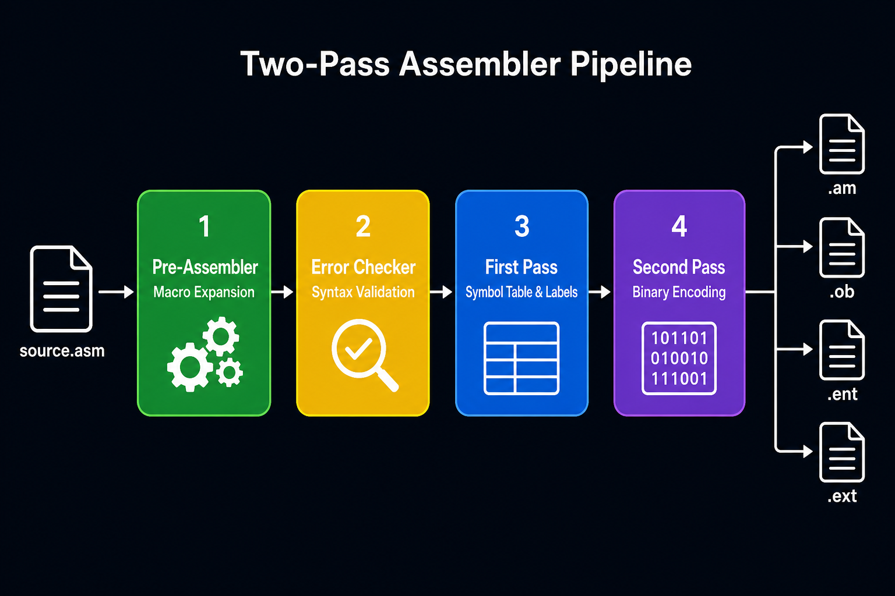
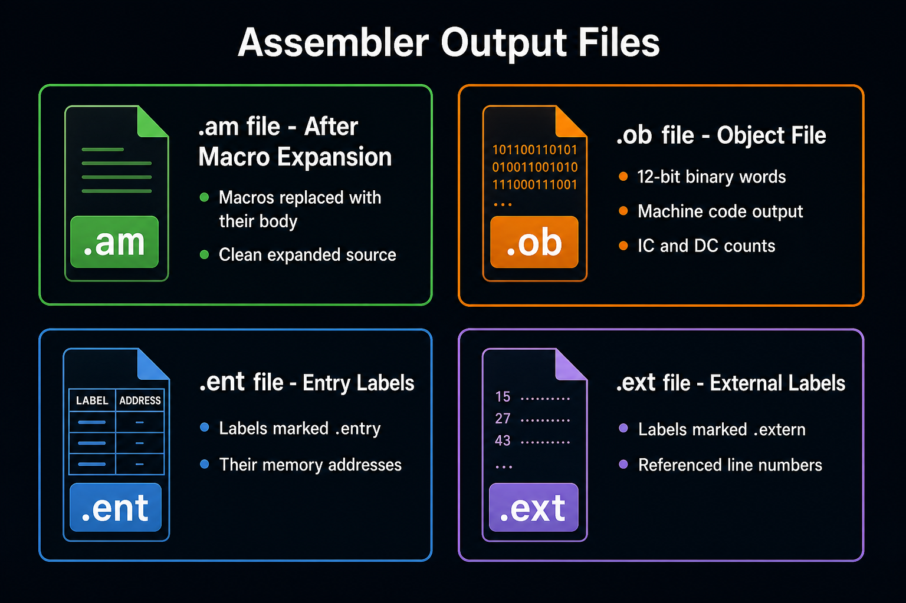
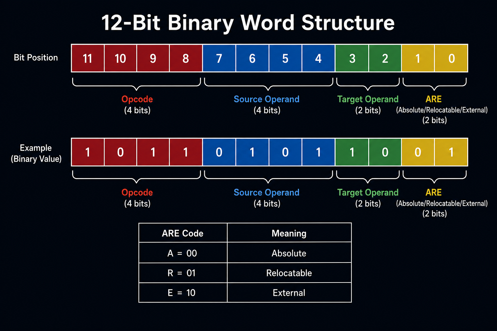

# Two-Pass Assembler in C

A complete two-pass assembler written in C that translates a custom assembly language into 12-bit binary machine code. Built as a systems programming project.

---

## What It Does

The assembler reads an assembly source file and produces four output files containing the expanded source, binary machine code, entry labels, and external label references.



---

## Output Files

For every input file `foo` provided, the assembler generates:



| File | Description |
|------|-------------|
| `foo.am` | Source after all macros have been expanded |
| `foo.ob` | Binary object file with 12-bit encoded instructions |
| `foo.ent` | Entry labels and their memory addresses |
| `foo.ext` | External labels and the lines that reference them |

---

## How to Build & Run

### Requirements
- GCC compiler
- `make`

### Build
```bash
make
```

### Run
```bash
./main file1 file2 ...
```

Pass one or more assembly source file names (without extension) as arguments. Example:
```bash
./main test
```
This reads `test` as the source and produces `test.am`, `test.ob`, `test.ent`, `test.ext`.

---

## The Assembly Language

The assembler supports a custom 12-bit word assembly language.

### Supported Instructions

| Instruction | Operands | Description |
|-------------|----------|-------------|
| `mov` | src, dst | Move value from source to destination |
| `cmp` | src, dst | Compare two values |
| `add` | src, dst | Add source to destination |
| `sub` | src, dst | Subtract source from destination |
| `lea` | src, dst | Load effective address |
| `clr` | dst | Clear operand to zero |
| `not` | dst | Bitwise NOT |
| `inc` | dst | Increment by 1 |
| `dec` | dst | Decrement by 1 |
| `jmp` | dst | Jump to address |
| `bne` | dst | Branch if not equal |
| `red` | dst | Read input |
| `prn` | dst | Print value |
| `jsr` | dst | Jump to subroutine |
| `rts` | — | Return from subroutine |
| `stop` | — | Halt execution |

### Addressing Modes

| Mode | Syntax | Example |
|------|--------|---------|
| Immediate | `#number` | `mov #5, @r1` |
| Direct (label) | `LABEL` | `jmp LOOP` |
| Register indirect | `@rN` | `add @r2, @r3` |

### Directives

| Directive | Description | Example |
|-----------|-------------|---------|
| `.data` | Define numeric data | `.data 6,-9,15` |
| `.string` | Define a string | `.string "hello"` |
| `.entry` | Declare a label as visible to other files | `.entry LOOP` |
| `.extern` | Declare a label defined in another file | `.extern W` |

### Macros

Define reusable blocks of code with `mcro` / `endmcro`:

```asm
mcro MYMACRO
    add @r1, @r2
    inc @r3
endmcro

; Use the macro by name:
MYMACRO
```

### Example Program

```asm
.entry LENGTH
.extern W
MAIN:   mov @r3, LENGTH
LOOP:   jmp L1
        prn -5
        bne W
        sub @r1, @r4
        bne END
END:    stop
.extern L3
STR:    .string "abcdef"
LENGTH: .data 6,-9,15
```

---

## Binary Word Structure

Each instruction is encoded as a 12-bit word:



- **Bits 11–8** — Opcode (4 bits, identifies the instruction)
- **Bits 7–4** — Source operand addressing mode (4 bits)
- **Bits 3–2** — Target operand addressing mode (2 bits)
- **Bits 1–0** — ARE flag: `00` Absolute, `01` Relocatable, `10` External

---

## Project Structure

```
├── main.c / main.h             Entry point — orchestrates all stages
├── share.h                     Shared types, constants, and structs
├── shareFunc.c                 Shared utility functions
│
├── preAssembler.c/.h           Pre-assembler stage (macro expansion)
├── funcPreAssembler.c          Pre-assembler helper functions
├── openMcro.c                  Writes expanded macro lines to .am file
├── mcroNamesAndLine.c          Builds linked list of macro definitions
├── funcOpenMcro.c              Open-macro helper functions
│
├── errors.c / erros.h          Error-checking stage
├── funcErrors.c                Error-checking helper functions
│
├── firstPass.c / firstPass.h   First-pass stage (symbol table)
├── funcFirstPass.c             First-pass helper functions
├── labelList.c                 Label linked-list operations
│
├── seconedPass.c / seconedPass.h  Second-pass stage (binary encoding)
├── funcSeconedPass.c           Second-pass helper functions
├── allBinary.c                 Full binary word assembly
├── funcAllBinary.c             Binary assembly helpers
├── binaryWords.c               Individual binary word encoders
│
└── makefile                    Build configuration
```

---

## Author

[tomerzi](https://github.com/tomerzi)
